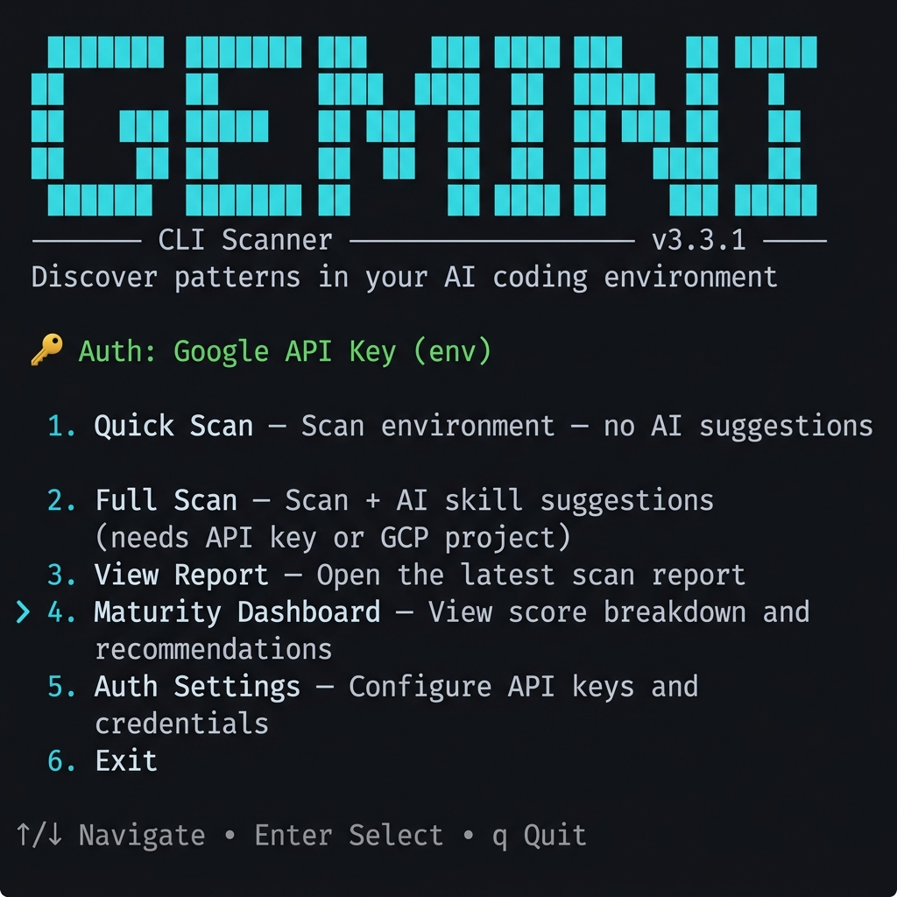

# gemini-cli-scanner

[](https://github.com/pauldatta/gemini-cli-scanner/actions/workflows/test.yml)
[](https://www.npmjs.com/package/gemini-cli-scanner)
[](https://nodejs.org)
[](LICENSE)

Discover patterns in your Gemini CLI and Claude Code environments. Extract tribal knowledge from how you *actually* use AI coding tools and surface it as reusable skills, agents, and best practices.

<p align="center">
  
</p>

## Quick Start

```bash
npx gemini-cli-scanner
```

No install required. Launches an interactive TUI with:

| Menu Item | What It Does |
|:---|:---|
| **Quick Scan** | Environment scan, optional repo discovery — no API key needed |
| **Full Scan** | Everything + AI-powered skill suggestions from your conversation patterns |
| **View Report** | Scrollable markdown report with `t` for TOC section-jump navigation |
| **Maturity Dashboard** | Score breakdown (0–115), tier, advisory recommendations |
| **Auth Settings** | Credential switching with `export` hints for session persistence |

### Headless mode

```bash
npx gemini-cli-scanner --skip-suggestions
npx gemini-cli-scanner --repos ~/Code --chat-days 30
```

## What This Does

1. **Catalogs** your MCP servers, skills, extensions, agents, policies, and context files
2. **Analyzes** conversation history — tools, models, topics, prompt patterns
3. **Scores maturity** (0–115) across 8 categories with actionable recommendations
4. **Discovers ecosystems** — Gemini CLI, Claude Code, Antigravity, Continue, Windsurf, JetBrains AI
5. **Suggests skills** using a two-stage AI pipeline grounded in your real usage data
6. **Produces** a shareable JSON manifest + markdown report (credentials auto-redacted)

## Maturity Model

The advisory engine evaluates 8 categories and assigns a maturity tier:

| Tier | Score | What It Means |
|:---|:---|:---|
| 🌱 Getting Started | 0–29 | Basic install, minimal config |
| 🔧 Intermediate | 30–59 | Active usage with some governance |
| ⚡ Advanced | 60–89 | Strong policies, skills, MCP governance |
| 🏆 Expert | 90–115 | Full-stack: hooks, extensions, context architecture |

📖 **[Full scoring breakdown and category details →](docs/advisory-engine.md)**

## Install as Extension

For `/scan` commands inside Gemini CLI:

```bash
gemini extensions install https://github.com/pauldatta/gemini-cli-scanner
```

## Configure (for AI skill suggestions)

```bash
# Option A: Vertex AI
export GOOGLE_CLOUD_PROJECT="your-project"

# Option B: API key
export GOOGLE_API_KEY="your-key"
```

Without these, the scanner runs fully — it just skips AI-powered skill suggestions.

📖 **[Skill suggestion pipeline details →](docs/skill-suggestions.md)**

## CLI Options

```
npx gemini-cli-scanner [OPTIONS]

--version, -v         Show version and exit
--gemini-dir PATH     Path to .gemini dir (default: ~/.gemini)
--home-dir PATH       Home directory for Claude scanning (default: ~)
--output-dir PATH     Output directory (default: ./scan-results)
--repos PATH [PATH..] Code repo paths or parent directories to scan
--repo-depth N        Max depth for recursive repo discovery (default: 3)
--chat-days N         Only include conversation data from the last N days
--skip-suggestions    Skip AI skill suggestion (no API key needed)
--json-only           Output JSON only, no markdown report
--skip-update-check   Don't check GitHub for newer versions
```

## Output

After running, check `scan-results/`:

- **`gemini-env-manifest.json`** — Structured data for aggregation
- **`gemini-env-report.md`** — Human-readable report with scores, recommendations, and skills

## Privacy & Redaction

Auto-redacted: API keys (`AIza...`, `sk-...`), OAuth tokens (`ya29...`), GitHub PATs (`ghp_...`), and any field named `token`, `secret`, `password`, or `api_key`.

**Not redacted:** user prompts, topics, project names. Review output before sharing.

**Not touched:** Shell history, browser data, or files outside `~/.gemini/`, `~/.claude/`, and `--repos` paths.

## Documentation

| Doc | Description |
|:---|:---|
| 📊 [Advisory Engine](docs/advisory-engine.md) | Scoring categories, maturity tiers, detailed point breakdowns |
| 🔍 [Scanning Reference](docs/scanning.md) | What gets scanned, recursive discovery, ecosystem detection |
| 🤖 [Skill Suggestions](docs/skill-suggestions.md) | Two-stage AI pipeline, quality standards, methodology |
| 📖 [Skill Identification](docs/skill-identification.md) | How patterns are extracted from conversation history |
| 👥 [For Teams](docs/teams.md) | Cross-team aggregation, maturity benchmarking, enterprise patterns |

## Developer Install

```bash
git clone https://github.com/pauldatta/gemini-cli-scanner.git
cd gemini-cli-scanner
make          # Interactive TUI
make test     # 155 tests across 9 test files
```

## Contributing

Issues are [automatically triaged](https://github.com/pauldatta/gemini-cli-scanner/actions/workflows/issue-triage.yml) by Gemini. Use the issue templates for [bug reports](.github/ISSUE_TEMPLATE/bug_report.yml) and [feature requests](.github/ISSUE_TEMPLATE/feature_request.yml). Collaborators can re-triage by commenting `/triage`.

## License

Apache 2.0
