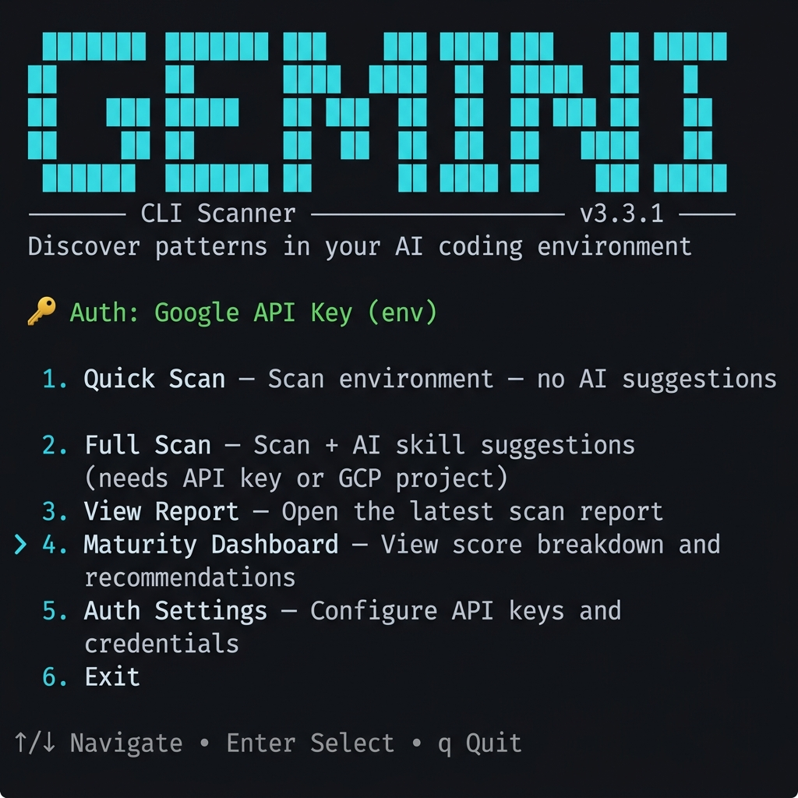
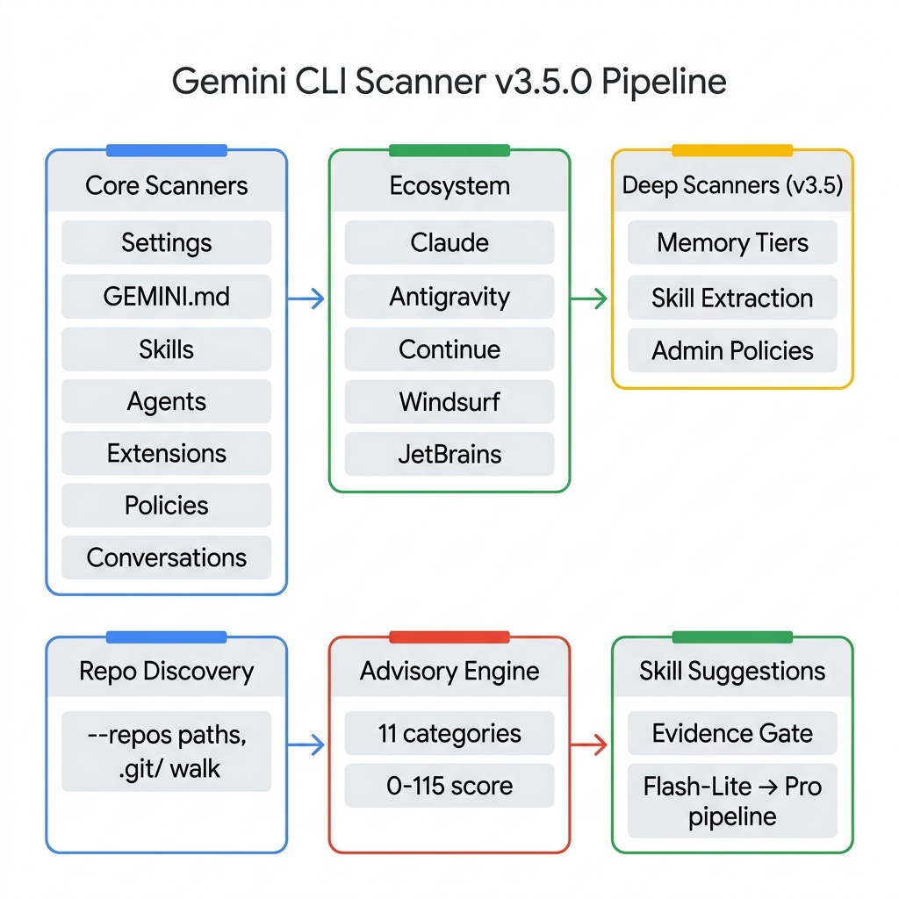

# gemini-cli-scanner

Audit and discover patterns across your AI coding tool ecosystem. Extract tribal knowledge from how you *actually* use AI coding tools and surface it as reusable skills, agents, and best practices.

<p align="center">
  
</p>

## What This Does

1. **Catalogs** MCP servers, skills, extensions, agents, policies, and context files
2. **Audits memory** — maps the [4-tier memory hierarchy](scanning.md#memory-architecture-4-tiers) with bloat and duplication detection
3. **Audits policies** — v0.40+ rules including modes, mcpName, denyMessage, interactive, commandRegex
4. **Detects skill extraction** — auto-created skills, inbox backlog, stale locks, pending patches
5. **Analyzes conversations** — tools, models, topics, prompt patterns, behavioral tool chains
6. **Scores maturity** (0–67) across [11 categories](advisory-engine.md) with actionable recommendations
7. **Discovers ecosystems** — Gemini CLI, Claude Code, Antigravity, Continue, Windsurf, JetBrains AI, OpenCode
8. **Suggests skills** using an [evidence-gated AI pipeline](skill-suggestions.md) grounded in real usage data
9. **Privacy by default** — output manifest contains only aggregate counts; raw prompts, topics, and project names stay in-memory for AI synthesis but never hit disk unless `--include-prompts` is passed

## Get Started

```bash
npx gemini-cli-scanner
```

No install required. See [Quick Start](quick-start.md) for full setup details.

## Pipeline

<p align="center">
  
</p>

## Maturity Tiers

| Tier | Score | What It Means |
|:---|:---|:---|
| 🌱 Getting Started | 0–33 | Basic install, minimal config |
| 🔧 Intermediate | 34–46 | Active usage with some governance |
| ⚡ Advanced | 47–60 | Strong policies, skills, MCP governance |
| 🏆 Expert | 61–67 | Full-stack: hooks, extensions, context architecture |

📖 **[Full scoring breakdown →](advisory-engine.md)**
